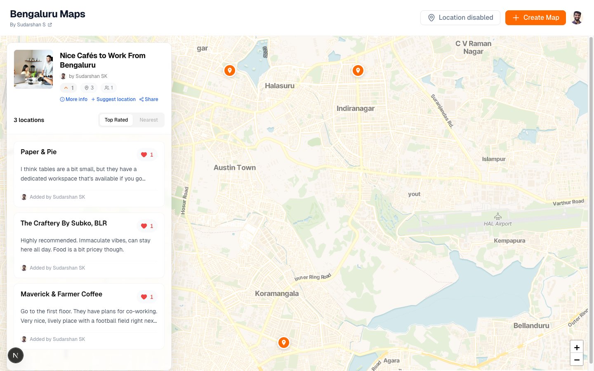
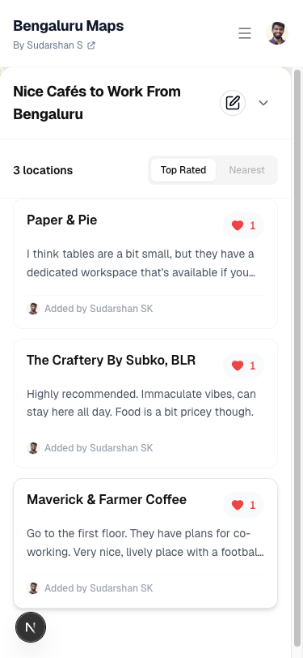

# Bengaluru Maps

[](https://opensource.org/licenses/MIT)

A community-driven platform to discover and share the best spots in Bengaluru. Tired of cool recommendations buried in WhatsApp groups? Bengaluru Maps aggregates curated lists of cafes, restaurants, events, and hidden gems in one searchable, shareable place.



## The Problem

Your friends have amazing Google Maps lists—Korean restaurants, quiet cafes to work from, new startups' hangouts—but they're locked away in personal accounts or scattered across WhatsApp groups. There's no common way to discover what's cool and new in the city. Bengaluru Maps solves this by creating a community-curated directory where anyone can create and share thematic maps of their favorite places.

## Features

- **Create Custom Maps**: Build curated collections with rich descriptions and markdown support
- **Contribute Locations**: Anyone can suggest new locations; map owners review and approve additions
- **One-Click Google Maps Import**: Copy-paste a Google Maps link and automatically transfer all your locations—zero friction migration from Google's ecosystem
- **Interactive Maps**: Powered by OpenStreetMap with a custom rendering layer that provides a Google Maps-like experience
- **Upvote Your Favorites**: Highlight the best spots on each map
- **Email Notifications**: Map owners stay informed when new locations are submitted
- **Secure Authentication**: Sign in with Google for simple, safe access

## How It Works

1. **Discover**: Browse maps created by others in Bengaluru—find Korean restaurants, coworking cafes, weekend hangouts, or whatever you're looking for
2. **Create**: Make your own map (a curated collection of favorite spots) and invite others to contribute
3. **Share**: Share the map URL with friends, post in communities, or make it public for the city to discover
4. **Grow**: Watch your map evolve as the community adds locations and upvotes favorites

## Mobile View

Responsive design for on-the-go discovery and contributions



## Tech Highlights

This project showcases some interesting technical decisions:

- **Smart Map Migration**: Implemented a Google Maps to OpenStreetMap converter that preserves location data with zero friction—users can migrate their existing lists in seconds
- **Custom Rendering Layer**: Built on OpenStreetMap but engineered to feel as polished and responsive as Google Maps, with clustering, filtering, and smooth interactions
- **Modern Stack**: Next.js 16 with React 19, TypeScript, Supabase for real-time data and auth, shadcn/ui for a polished interface, and React Hook Form + Zod for validated input

## Getting Started

```bash
npm run dev
```

Open [http://localhost:3000](http://localhost:3000) with your browser.

### Environment Variables

Create a `.env.local` file:

```
NEXT_PUBLIC_SUPABASE_URL=your_supabase_url
NEXT_PUBLIC_SUPABASE_ANON_KEY=your_supabase_anon_key
NEXT_PUBLIC_GOOGLE_MAPS_API_KEY=your_google_maps_api_key
NEXT_PUBLIC_SITE_URL=your_site_url_for_production
```

See `.env.example` for details.

### Database Setup

```bash
supabase db push
```

This runs migrations in the correct order. Alternatively, run migrations manually in Supabase SQL Editor in this order:

- `20251127151321_add_city_columns.sql`
- `20251127152500_update_rpc_functions_city.sql`
- `20251127160000_add_location_votes.sql`
- `20251127170000_add_location_votes_rls.sql`

## Tech Stack

- **Framework**: Next.js 16 with React 19
- **Authentication**: Supabase Auth (Google OAuth)
- **Database**: Supabase (PostgreSQL + RLS policies)
- **Maps**: OpenStreetMap + Leaflet with custom rendering
- **Styling**: Tailwind CSS + shadcn/ui
- **Forms**: React Hook Form + Zod validation
- **Markdown**: React Markdown + MDXEditor
- **Fonts**: Geist from Vercel

## Project Structure

```
/app          → Next.js App Router pages and layouts
/components   → Reusable UI components
/lib
  /context    → React context providers
  /hooks      → Custom React hooks
  /supabase   → Supabase client and DB functions
  /utils      → Helper utilities
  /validations→ Zod schemas
/public       → Static assets
```

## Contributing

We'd love help from developers interested in community platforms, maps, or just building cool stuff for Bengaluru!

1. Fork the repository
2. Create a feature branch (`git checkout -b feature/your-feature`)
3. Make your changes
4. Commit (`git commit -m 'feat: description'`)
5. Push and open a Pull Request

Areas we'd love help with:

- Performance improvements to map rendering
- Additional data import sources (beyond Google Maps)
- Enhanced location discovery (filters, search, recommendations)
- Mobile experience refinements

## License

MIT License - see [LICENSE](LICENSE) file.

## Created By

[Sudarshan S](https://x.com/realsudarshansk)
